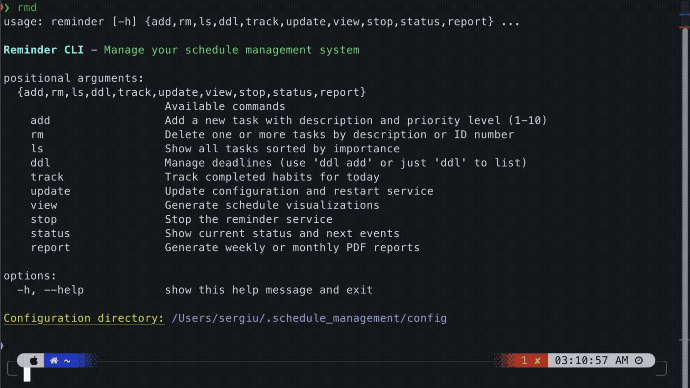
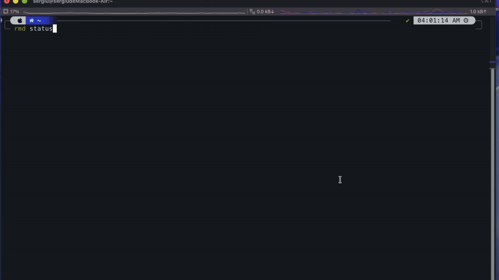

# Schedule Everything

[](https://github.com/sergiudm/schedule-everything/actions/workflows/tests.yml)
[](https://pypi.org/project/schedule-management)
[](https://opensource.org/licenses/MIT)
[](https://sergiudm.github.io/schedule-everything/)
[](https://deepwiki.com/sergiudm/schedule-everything)
[中文版本](README_zh.md)

A simple, persistent way to manage your daily schedule.

<table>
  <tr>
    <td>
      
    </td>
    <td>
      
    </td>
  </tr>
</table>

## ✨ Features

- **TOML Configuration**: Schedules are defined in clean, human-readable, and version-control friendly TOML files.
- **Dual Alerts**: Persistent notifications (modal dialogs) + audible sounds ensure you never miss a reminder.
- **Smart Rotation**: Automatically switches between **odd-week** and **even-week** schedules.
- **Flexible Events**: Supports time blocks (e.g., Pomodoro), specific time points, and recurring daily routines.
- **CLI Suite**: Integrated tools for managing tasks, tracking habits, and monitoring deadlines.
- **AI-Ready**: Easily generate configurations using LLMs from any text description.

---

## 🚀 Quickstart

### 1. Setup Configuration
Copy the templates to create your configuration files in `config/`:

```bash
cp config/settings_template.toml config/settings.toml
cp config/week_schedule_template.toml config/odd_weeks.toml
cp config/week_schedule_template.toml config/even_weeks.toml
```

### 2. Edit Configs
Define your routine in `config/`.
- **`settings.toml`**: Global settings and reusable time blocks (e.g., `pomodoro = 25`).
- **`odd_weeks.toml` / `even_weeks.toml`**: Your daily schedules.

**Example Schedule Entry:**
```toml
[monday]
"09:00" = "pomodoro"                              # Reusable block (start + end alert)
"14:00" = { block = "meeting", title = "Sync" }   # Block with custom title
"22:00" = "Go to sleep 😴"                        # Simple time point alert
```

> [!TIP]
> Use [our prompts](docs/prompt) to generate these configs instantly using an AI model.

### 3. Install
Run the installer to set up the background service:

```bash
./install.sh
```
*Follow the output instructions to load the launchd agent if required.*

---

## 🛠️ CLI Reference

Add the following to your shell profile (e.g., `~/.zshrc`) to use the `reminder` command:

```bash
export PATH="$HOME/schedule_management:$PATH"
export REMINDER_CONFIG_DIR="$HOME/schedule_management/config"
alias reminder="$HOME/schedule_management/reminder"
```

### Command Overview

| Category      | Command                           | Description                                  |
| ------------- | --------------------------------- | -------------------------------------------- |
| **System**    | `reminder update`                 | Reload config and restart background service |
|               | `reminder status [-v]`            | Show upcoming events (or full schedule)      |
|               | `reminder stop`                   | Stop the alarm service                       |
| **Tasks**     | `reminder add "task" <1-10>`      | Add/update task with importance level        |
|               | `reminder ls`                     | List tasks by importance                     |
|               | `reminder rm "task"` / `rm <id>`  | Remove task by name or ID                    |
| **Deadlines** | `reminder ddl`                    | Show deadlines with urgency status           |
|               | `reminder ddl add "name" "MM.DD"` | Add or update a deadline                     |
| **Habits**    | `reminder track <ids...>`         | Log completed habit IDs for today            |

> For detailed usage, refer to the [CLI Overview](https://sergiudm.github.io/schedule-everything/docs/cli/overview).

### Usage Examples

```bash
# Add a high-priority task
reminder add "Finish Report" 9

# Add a deadline for Dec 25th
reminder ddl add "Project Launch" "12.25"

# Track habits 1 and 2 as done for today
reminder track 1 2
```

---

## 🗺️ Roadmap

- [x] Time point alarms
- [x] Default schedule templates
- [x] Schedule visualization
- [x] Installation script
- [x] Skip-day logic 
- [x] CLI tool
- [x] Task management system with importance levels
- [x] Deadline management system
- [x] Habit tracking system
- [x] Prompts for LLMs to create TOML configs
- [x] Daily summary before bedtime
- [x] Today's tasks overview
- [x] Self rewarding system
- [x] History analysis and weekly reports
- [ ] Multi-language support
- [ ] Website for schedule sharing
- [ ] Better alarm UI
- [ ] **Windows support**

---

## 📄 License

Distributed under the **MIT License**. See [LICENSE](LICENSE).