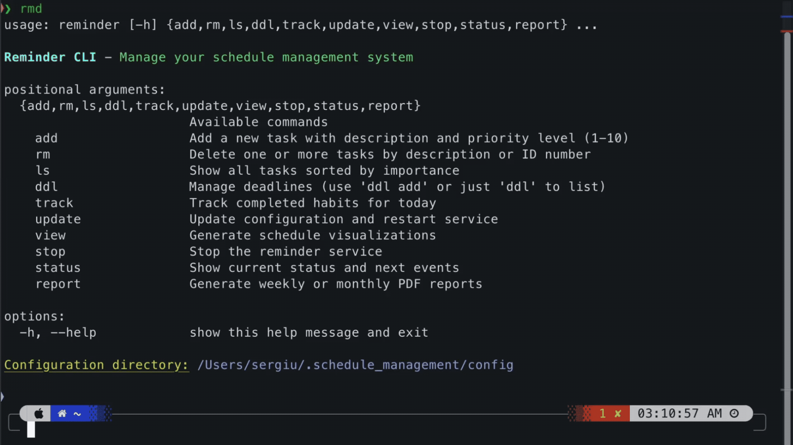
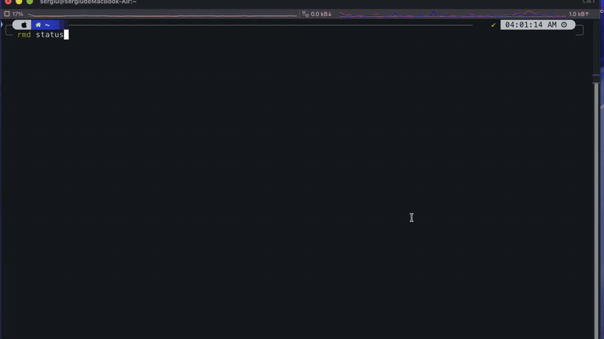
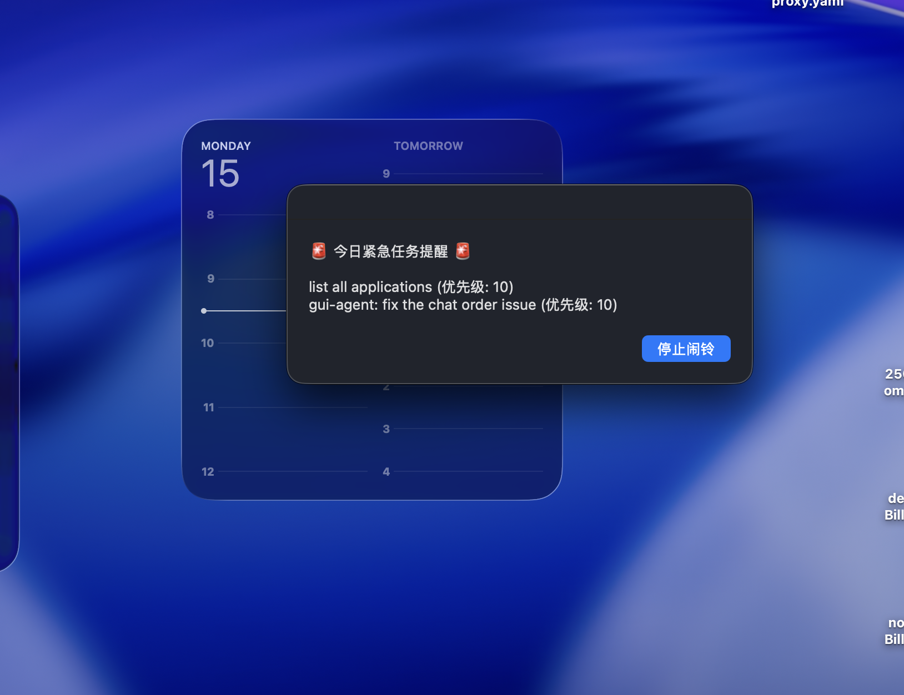

# Schedule Everything

[](https://github.com/sergiudm/schedule-everything/actions/workflows/logic-tests.yml)
[](https://github.com/sergiudm/schedule-everything/actions/workflows/cli-tests.yml)
[](https://pypi.org/project/schedule-management)
[](https://opensource.org/licenses/MIT)
[](https://sergiudm.github.io/schedule-everything/)
[](https://deepwiki.com/sergiudm/schedule-everything)
[中文版本](README_zh.md)

A simple, persistent way to manage your daily schedule.

<table>
  <tr>
    <td>
      
    </td>
    <td>
      
    </td>
    <td>
      
    </td>
    <td>
      
    </td>
  </tr>
</table>

## ✨ Features

- **TOML Configuration**: Schedules are defined in clean, human-readable, and version-control friendly TOML files.
- **Dual Alerts**: Persistent notifications (modal dialogs) + audible sounds ensure you never miss a reminder.
- **Smart Rotation**: Automatically switches between **odd-week** and **even-week** schedules.
- **Flexible Events**: Supports time blocks (e.g., Pomodoro), specific time points, and recurring daily routines.
- **CLI Suite**: Integrated tools for managing tasks, tracking habits, and monitoring deadlines.
- **AI-Ready**: Easily generate configurations using LLMs from any text description.

---

## 🚀 Quickstart

### 1. Install
```bash
git clone --recurse-submodules https://github.com/sergiudm/schedule-everything.git
cd schedule-everything
./install.sh
```

Install OpenCode CLI from the bundled submodule (required by `reminder setup`):

```bash
./third_party/opencode/install --no-modify-path
```

### 2. Build Your Schedule with AI Assistance
```bash
reminder setup
```
This command will guide you through configuring model credentials and interactively building or modifying your schedules.
The setup agent is powered by OpenCode (`opencode run`) and can attach your timetable files directly.

---

## 🛠️ Manual Setup

### 1. Setup Configuration
Copy the templates to create your configuration files in `config/`:

```bash
cp config/settings_template.toml config/settings.toml
cp config/week_schedule_template.toml config/odd_weeks.toml
cp config/week_schedule_template.toml config/even_weeks.toml
```

### 2. Edit Configs
Define your routine in `config/`.
- **`settings.toml`**: Global settings and reusable time blocks (e.g., `pomodoro = 25`).
- **`odd_weeks.toml` / `even_weeks.toml`**: Your daily schedules.

**Example Schedule Entry:**
```toml
[monday]
"09:00" = "pomodoro"                              # Reusable block (start + end alert)
"14:00" = { block = "meeting", title = "Sync" }   # Block with custom title
"22:00" = "Go to sleep 😴"                        # Simple time point alert
```

> [!TIP]
> Use [our prompts](docs/prompt) to generate these configs instantly using an AI model.

### 3. Install
Run the installer to set up the background service:

```bash
./install.sh
```
During installation, existing config is checked and any missing required values are prompted one by one.
*Follow the output instructions to load the launchd agent if required.*

### 4. Optional: Interactive AI Setup
Use the new setup wizard to configure model credentials and build/modify schedules interactively:

```bash
reminder setup
```

The wizard stores model settings in `~/.schedule_management/llm.toml`, checks whether a complete local schedule config already exists, and then guides you to build or modify schedules through OpenCode.
In build mode, it proactively asks profile questions (basic info, goals, habits, preferences, constraints), generates a pure-text schedule summary for confirmation, and only then writes TOML configuration files.
During build/modify turns, the OpenCode-backed agent can attach local files/images and use built-in tooling to reason over project/context files when needed.

---

## 🛠️ CLI Reference

Add the following to your shell profile (e.g., `~/.zshrc`) to use the `reminder` command:

```bash
export PATH="$HOME/schedule_management:$PATH"
export REMINDER_CONFIG_DIR="$HOME/schedule_management/config"
alias reminder="$HOME/schedule_management/reminder"
```

### Command Overview

| Category      | Command                           | Description                                  |
| ------------- | --------------------------------- | -------------------------------------------- |
| **System**    | `reminder update`                 | Reload config and restart background service |
|               | `reminder setup`                  | Interactive AI setup powered by OpenCode with profile intake, summary-first planning, build/modify flows, and optional file-aware reasoning |
|               | `reminder status [-v]`            | Show upcoming events (or full schedule)      |
|               | `reminder view`                   | Generate and view a PDF schedule visualization |
|               | `reminder edit <file>`            | Edit a config file directly                  |
|               | `reminder stop`                   | Stop the alarm service                       |
| **Tasks**     | `reminder add "task" <1-10>`      | Add/update task with importance level        |
|               | `reminder ls`                     | List tasks by importance                     |
|               | `reminder rm "task"` / `rm <id>`  | Remove task by name or ID                    |
| **Deadlines** | `reminder ddl`                    | Show deadlines with urgency status           |
|               | `reminder ddl add "name" "MM.DD"` | Add or update a deadline                     |
|               | `reminder ddl rm <events...>`     | Remove one or more deadlines                 |
| **Habits**    | `reminder track [ids...]`         | Log completed habits for today (opens a prompt if no IDs) |
| **Reports**   | `reminder report <type>`          | Generate weekly or monthly PDF reports       |

> For detailed usage, refer to the [CLI Overview](https://sergiudm.github.io/schedule-everything/docs/cli/overview).

### Usage Examples

```bash
# Add a high-priority task
reminder add "Finish Report" 9

# Add a deadline for Dec 25th
reminder ddl add "Project Launch" "12.25"

# Track habits 1 and 2 as done for today
reminder track 1 2

# Or use the prompt window (no IDs)
reminder track

# Launch interactive setup/build wizard
reminder setup
```

Habit prompts can also be scheduled automatically via `config/settings.toml` (`[tasks].habit_prompt = "HH:MM"`).

---

## 🗺️ Roadmap

- [x] Time point alarms
- [x] Default schedule templates
- [x] Schedule visualization
- [x] Installation script
- [x] Skip-day logic 
- [x] CLI tool
- [x] Task management system with importance levels
- [x] Deadline management system
- [x] Habit tracking system
- [x] Prompts for LLMs to create TOML configs
- [x] Daily summary before bedtime
- [x] Today's tasks overview
- [x] Self rewarding system
- [x] History analysis and weekly reports
- [ ] Multi-language support
- [ ] Website for schedule sharing
- [ ] Better alarm UI
- [ ] **Windows support**

---

## 📄 License

Distributed under the **MIT License**. See [LICENSE](LICENSE).
