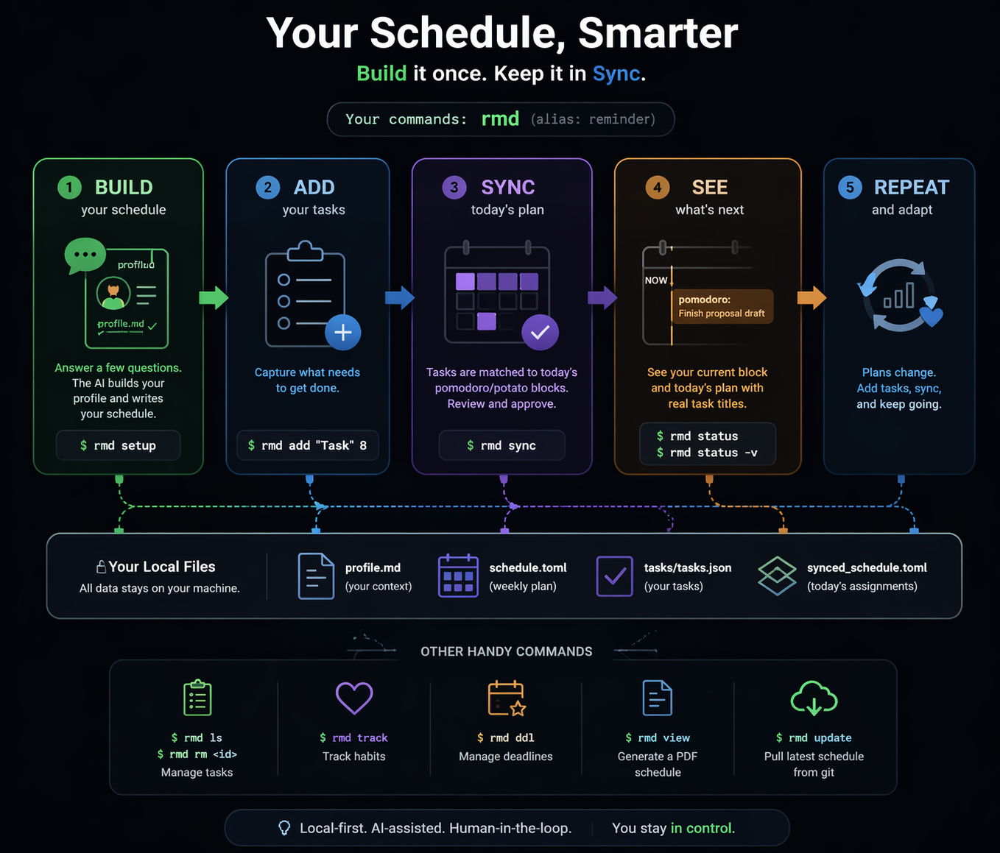

# Schedule Everything

<p align="center">
  
</p>

[](https://github.com/sergiudm/schedule-everything/actions/workflows/logic-tests.yml)
[](https://github.com/sergiudm/schedule-everything/actions/workflows/cli-tests.yml)
[](https://pypi.org/project/schedule-management)
[](https://opensource.org/licenses/MIT)
[](https://sergiudm.github.io/schedule-everything/)
[](https://deepwiki.com/sergiudm/schedule-everything)
[中文版本](README_zh.md)

Schedule Everything is a local-first, AI-assisted scheduling CLI for building a
durable weekly routine and then turning today's focus blocks into concrete
work. `rmd setup` builds or refines your schedule from a profile, `rmd sync`
assigns real tasks to today's `pomodoro` and `potato` blocks, and `rmd` is the
primary CLI name while `reminder` remains as a compatibility alias.

## Workflow

<p align="center">
  
</p>

## Quick Start

### 1. Install

```bash
git clone --recurse-submodules https://github.com/sergiudm/schedule-everything.git
cd schedule-everything
./install.sh
./third_party/opencode/install --no-modify-path
```

`./install.sh` sets up the local environment and config scaffold. OpenCode is
required for AI-assisted commands such as `rmd setup` and `rmd sync`.

### 2. Build Your Schedule with One Command!

```bash
rmd setup
```

After a short conversation about your workday, constraints, and habits,
`rmd setup` stores model settings in `~/.schedule_management/llm.toml`, builds
or updates `profile.md`, shows a summary for confirmation, and only then
writes your schedule files into `user_config_0`. Later accepted changes are
saved as `user_config_1`, `user_config_2`, and so on under the same config
root while `tasks/` remains shared.

Once that schedule exists, the system can remind you about scheduled blocks,
habit/deadline prompts, and give you both a live status view and a PDF
visualization of the result.

### 3. Add Tasks and Sync Today

Plans change faster than weekly templates. When that happens, add tasks and
sync the current day instead of rebuilding the whole schedule.

```bash
rmd add "Finish proposal draft" 9
rmd add "Review PR #128" 7
rmd sync
```

`rmd sync` reads `tasks/tasks.json`, proposes task assignments for today's
pomodoro/potato blocks, and regenerates if you reject the preview with
feedback.

### 4. Check the Result

```bash
rmd status
rmd status -v
rmd view
rmd update
rmd switch 0
```

When a sync overlay exists for today, `rmd status` shows the block type and
the specific assigned event, for example `pomodoro: Finish proposal draft`.
`rmd update` reloads the reminder service. If your config directory is a git
repository, it pulls the latest schedule changes first; otherwise it skips the
git step and reloads your local files as-is.

## Core Commands

| Command | What it does |
| --- | --- |
| `rmd setup` | Build or modify your schedule with a profile-first AI workflow |
| `rmd sync` | Assign today's pomodoro/potato blocks to tasks with preview + approval |
| `rmd status [-v]` | Show what is happening now and today's schedule, including synced titles |
| `rmd add/ls/rm` | Manage the task list that feeds the sync flow |
| `rmd track` | Record habits |
| `rmd ddl` | Manage deadlines |
| `rmd view` | Generate a PDF schedule visualization |
| `rmd switch <id>` | Activate a different `user_config_n` snapshot and reload the service |

## Manual Setup and Docs

The low-level manual configuration flow has been moved to the docs.

- [Introduction](https://sergiudm.github.io/schedule-everything/docs/intro)
- [Quick Start](https://sergiudm.github.io/schedule-everything/docs/quick-start)
- [Installation](https://sergiudm.github.io/schedule-everything/docs/installation)
- [Configuration Overview](https://sergiudm.github.io/schedule-everything/docs/configuration/overview)
- [CLI Overview](https://sergiudm.github.io/schedule-everything/docs/cli/overview)

## License

Distributed under the **MIT License**. See [LICENSE](LICENSE).
